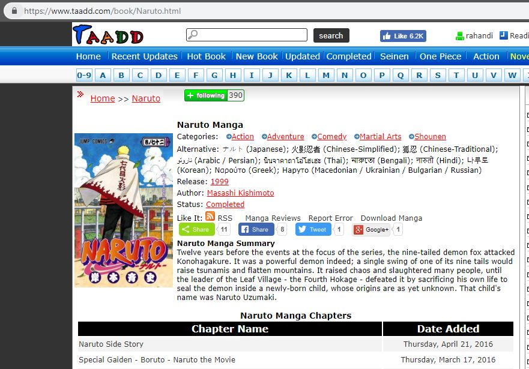

# Bad Design
Rahandi Noor Pasha - 05111640000054 - HCI-A

## Github
### No button to add new branch
This is my experience, when i'm on a project and i need to create a new branch without using git bash i find it difficult to know how to create a new branch, i have to google it before i knew how to create a new branch

### Suggestions
Add a button to create a new branch, for user who's not often on using github, this will be a great help

## Taadd
### 1. No noteable sign after clicking following button on a manga
When user open a manga page (example: https://www.taadd.com/book/Naruto.html) and clicking 'following' button there's no easily visible change on the button, the only changes happened is the counter of user who follow that manga is incremented which is will be easily neglected when the user is not paying a lot of attention

### 2. There's no button to unfollow a manga
This happen when i'm creating this task, i'm trying to follow a manga to check the button but i can't unfollow it without opening my profile page, i've tried re-clicking the 'following' button multiple times, but nothing happen

### Suggestion
- Create a JQuery or something to change the 'following' button when user is clicking the button or already following the manga
- Create a new button or change the 'following' button to 'unfollow' so the user can easily unfollow a manga without having to open the profile pages