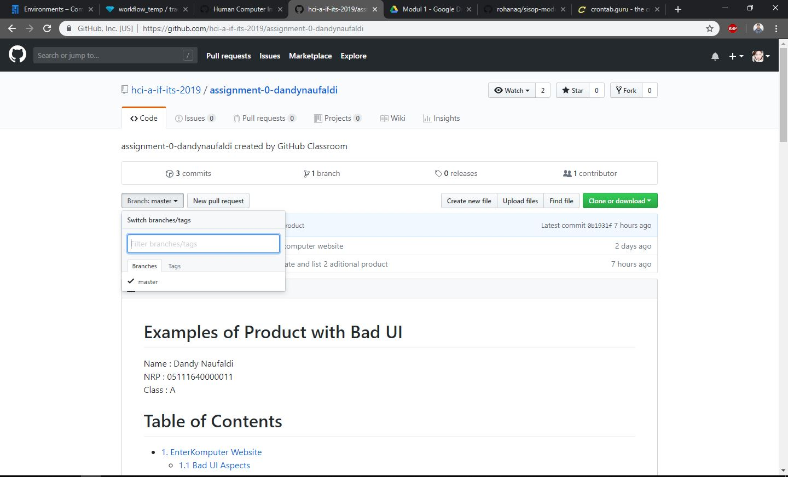

# Bad Design
Rahandi Noor Pasha - 05111640000054 - HCI-A

## Github
### No button to add new branch
This is my experience, when i'm on a project and i need to create a new branch without using git bash i find it difficult to know how to create a new branch, i have to google it before i knew how to create a new branch

### Suggestions
Add a button to create a new branch, for user who's not often in using github, this would be a great help

### Video
https://youtu.be/QU6oQF-C-CA

## Taadd
### 1. No noteable sign after clicking following button on a manga
When user open a manga page (example: https://www.taadd.com/book/Naruto.html) and clicking 'following' button there's no easily visible change on the button, the only changes happened is the counter of user who follow that manga is incremented which is will be easily neglected when the user is not paying a lot of attention

### 2. There's no button to unfollow a manga
This happen when i'm creating this task, i'm trying to follow a manga to check the button but i can't unfollow it without opening my profile page, i've tried re-clicking the 'following' button multiple times, but nothing happen

### Suggestion
- Create a JQuery or something to change the 'following' button when user is clicking the button or already following the manga
- Create a new button or change the 'following' button to 'unfollow' so the user can easily unfollow a manga without having to open the profile pages

### Video
https://youtu.be/CQPUYwX8JLk

## Slack
### There's no easily recognized way to join to a new channel
When i want to join to certain channel, i find it difficult to find the button or anything that let me join a channel, there's a plus symbol next to channel text, first thing that came to my mind is that symbol must be the button to join a channel, but unfortunately that button is used for creating a new channel

### Sugestion
create a new button with text 'join' to make joining a channel easier for a new user

### Video

https://youtu.be/95HD22FBoTQ